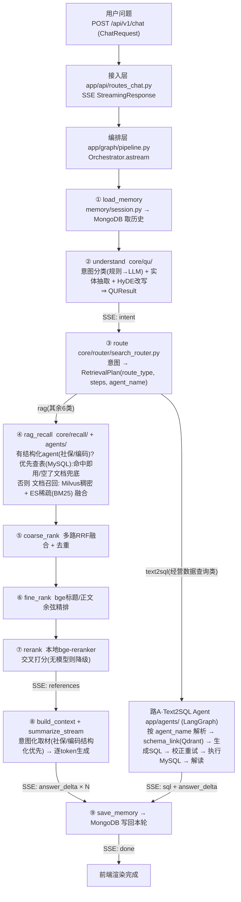
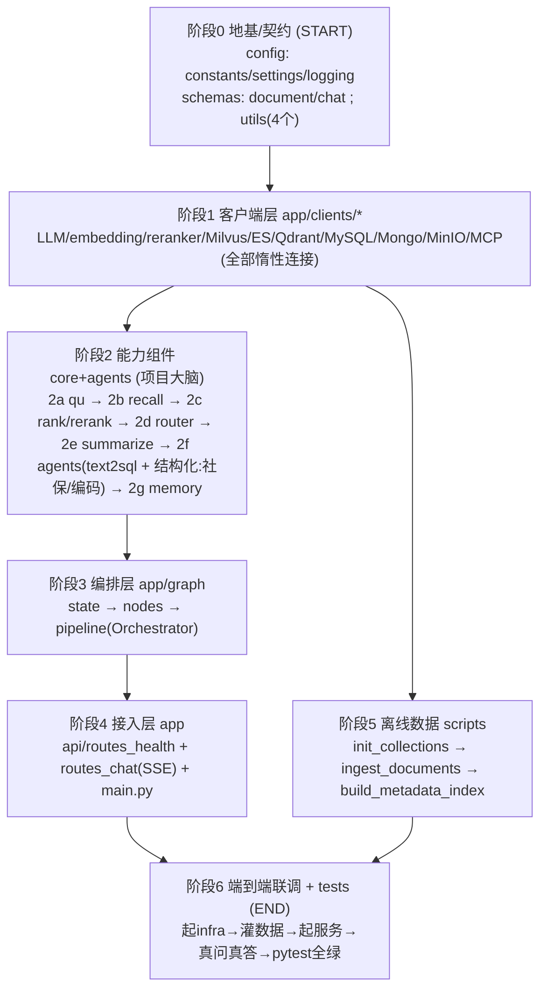

# 税务智能问答平台 · 学习导图

本文给两张图：
- **图一 运行流程图**：一个问题在系统里的真实旅程，用来**建立认知**。
- **图二 从零构建顺序图**：不依赖 AI 独立做这个项目，从哪开始到哪结束，用来**学习代码库**。

> VSCode 里对本文件右键 → "Open Preview"（或 Ctrl+Shift+V），下面的 Mermaid 会渲染成框图。

---

## 图一：运行流程图（建立认知）

运行方向 = 从上层往下调：HTTP 进来 → 编排器按顺序驱动各能力 → 流式吐答案。

基础设施（全部惰性连接，由 `app/clients/*` 封装）：
LLM(OpenAI兼容) · bge-m3嵌入 · reranker · Milvus(稠密) · ES(BM25) · Qdrant(数仓元数据) · MySQL(数仓) · MongoDB(会话) · MinIO(图片)。

**SSE 事件时序**：`intent → retrieval(各阶段) → references →（text2sql 分支为 sql）→ answer_delta×N → done`（任意阶段异常发 `error`）。

**三条路（route 决定，2026-06-06 升级后）**：
- **路A 经营数据查询类** → Text2SQL Agent（按 agent_name 解析，生成 SQL 查数仓，不走 RAG/排序）；
- **路B 社保类/商品编码类** → 结构化查表 Agent【优先】：命中即用、跳过文档；空了才退回文档 RAG 兜底；
- **路C 其余 6 类** → 文档 RAG（召回→排序→摘要）。

> `agent_name` 一个字段两用：route_type=text2sql 时=替换式 agent；route_type=rag 时=附加的结构化 agent；None=纯文档 RAG。

---

## 图二：从零构建顺序图（学习代码库）

构建方向 = 从地基往上搭：下层不依赖上层，先有下层才能写上层。按此顺序读/写即可重建整库。

> 阶段5（数据脚本）只依赖阶段1，可与阶段2/3 并行做；其余是严格的层层依赖。

### 逐阶段构建笔记（每阶段：目标 / 建什么 / 依赖 / 关键点 / 怎么验证）

**阶段0 · 地基与契约（START）**
- 目标：先把"数据长什么样 + 全局配置 + 日志 + 公共工具"定死，这是所有文件的共同依赖，先定接口后不返工。
- 建：`config/constants.py`(枚举词汇表) `config/settings.py`(pydantic-settings配置) `config/logging_config.py`(统一日志) `app/schemas/document.py`(Document/QUResult/RetrievalPlan/Text2SQLResult) `app/schemas/chat.py`(ChatRequest/SSEMessage) `app/utils/`(prompt_loader/sse/normalize/timing)。
- 依赖：无（最底层）。
- 关键点：数据结构(schemas)就是各层之间的"合同"，想清楚字段比写代码更重要。
- 验证：`python config/settings.py`、`python -c "from app.schemas.document import Document"` 不报错。

**阶段1 · 基础设施客户端层**
- 目标：把每个外部服务封装成一个类，上层只调方法、不碰连接细节。
- 建：`app/clients/` 下 10 个客户端。
- 依赖：阶段0(config)。
- 关键点：①惰性连接(import 不连，首次调用才连)，保证缺 infra 也能启动；②http/local 双模式切换；③统一中文异常。
- 验证：起对应 docker 服务后，跑该 client 文件底部的 `__main__` 自测块。

**阶段2 · 能力组件 core（最花时间、最值得学）**
- 目标：实现"业务大脑"，每个组件都是清晰的 输入→输出，可单独测。
- 建（按链路顺序）：
  - `core/qu/`：intent(意图分类) → extractor(实体抽取) → query_rewrite(扩写+HyDE) → understanding(编排)。输入 `str` → 输出 `QUResult`。
  - `core/recall/`：base → hybrid(单库 dense+sparse 融合) → manager(多库并行)。输入 `QUResult` → 输出 `list[Document]`。
  - `core/rank/` + `core/rerank/`：coarse_rank(RRF去重) → fine_rank(bge精排) → rerank(交叉重排)。检索漏斗。
  - `core/router/search_router.py`：意图 → `RetrievalPlan`（对标爱搜税路由表，按意图调稀疏/稠密权重）。
  - `core/summarize/summarizer.py`：拼上下文 + 带引用流式生成。
  - `agents/text2sql_agent.py`：LangGraph 子图(选表→生成SQL→校正→执行→解读)。
  - `memory/session.py`：基于 Mongo 的多轮记忆。
- 依赖：阶段0+1。
- 验证：各文件 `__main__`；`pytest tests/test_qu.py tests/test_router.py`(纯逻辑，不连外部)。

**阶段3 · 编排层 graph**
- 目标：把阶段2 的组件按顺序"串成一条链"。
- 建：`graph/state.py`(GraphState) → `graph/nodes.py`(每个节点=调组件+写state，很薄) → `graph/pipeline.py`(build_pipeline_graph 的 LangGraph 图 + Orchestrator.astream 流式驱动)。
- 依赖：阶段2 全部。
- 验证：`python -m app.graph.pipeline`(编译图)；`pytest tests/test_smoke.py`。

**阶段4 · 接入层 app**
- 目标：把链路暴露成 HTTP 接口。
- 建：`api/routes_health.py` → `api/routes_chat.py`(SSE 把 Orchestrator 事件转帧) → `main.py`(FastAPI 入口、lifespan 起日志、挂路由)。
- 依赖：阶段3。
- 验证：`uvicorn app.main:app`、`curl /health`、浏览器 `/docs` 调 `/chat`。

**阶段5 · 离线数据 scripts（可与 2/3 并行）**
- 目标：先把数据灌进库，在线检索才有东西可查。
- 建：`init_collections.py`(幂等建 Milvus/ES/Qdrant) → `ingest_documents.py`(解析→切分→嵌入→写Milvus+ES) → `build_metadata_index.py`(数仓元数据→Qdrant，供Text2SQL)。
- 依赖：阶段1(clients)。
- 验证：init 建库；`ingest --dry-run` 看切分；正式 ingest 后能在库里查到。

**阶段6 · 端到端联调 + tests（END）**
- 目标：全链路真问真答。
- 做：起 infra(docker compose) → 灌示例数据 → `uvicorn` 起服务 → `/docs` 提问 → 看到 `intent→references→answer_delta→done`；`pytest` 全绿。
- END 标志：**一个自然语言问题能从 HTTP 进来，带引用的答案流式吐出来**。

---

## 两图的关系（一句话）

- **图一(运行)** 自上而下：理解"已经建好的系统怎么工作"。
- **图二(构建)** 自下而上：理解"这个系统是怎么一层层搭出来的"。
- 学习顺序建议：先用图一在脑子里跑通一个问题，再按图二阶段0→2 进代码，**把最多精力放在阶段2 的 qu→recall→rank→summarize**（检索增强问答的精华全在这）。
